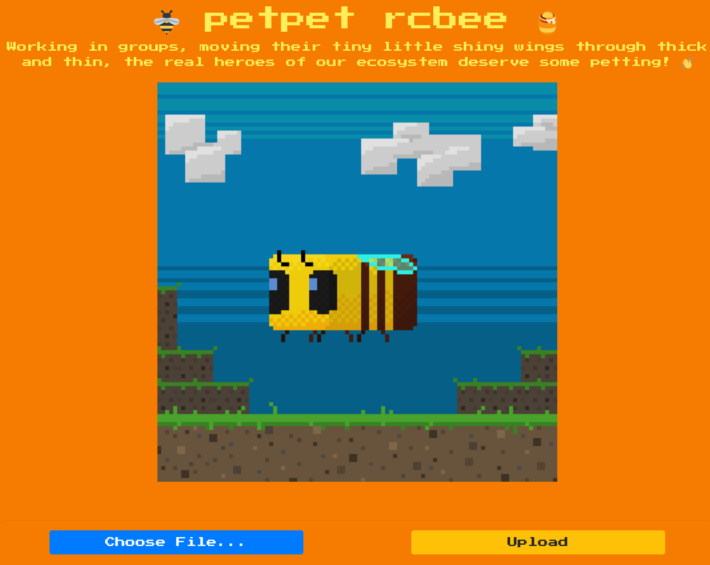

# petpet rcbee🐝

**Category**: Web

**Difficulty**: Easy

Yoo ;)

Ready to review the challenge? 💃

So lets start by downloading & unzipping the file to our local machine


# Analysis

## Overview

First, we are going to review the website. Hmm.. and we see that there is an option to upload files.. interesting 🤔



So lets upload some files ig hehe😈 but wait we don't know which file extension is acceptable 😱

Now, I want to exploit the files we downloaded. I looked through the files and found something we were looking for.

Look at this part of the code that appears in "util.py" 🧐

```py
import tempfile, glob, os
from werkzeug.utils import secure_filename
from application import main
from PIL import Image

ALLOWED_EXTENSIONS = set(['png', 'jpg', 'jpeg'])

generate = lambda x: os.urandom(x).hex()

def allowed_file(filename):
    return '.' in filename and \
        filename.rsplit('.', 1)[1].lower() in ALLOWED_EXTENSIONS
```

```py
tmp_path = save_tmp(file)

        bee = Image.open(tmp_path).convert('RGBA')
        frames = [Image.open(f) for f in sorted(glob.glob('application/static/img/*'))]
        finalpet = petmotion(bee, frames)

        filename = f'{generate(14)}.gif'
        finalpet[0].save(
            f'{main.app.config["UPLOAD_FOLDER"]}/{filename}', 
            save_all=True, 
            duration=30, 
            loop=0, 
            append_images=finalpet[1:], 
        )

```

Well.. It turns out that we can only upload files of png/jpg/jpeg type and then it makes a gif.. SO COOL!

Let's try to upload the image! and Yep it displays the gif

Hmm.. But what is the path of the uploaded file???

Okok there is another file you should see "config.py"
```py
from application.util import generate

class Config(object):
    SECRET_KEY = generate(50)
    UPLOAD_FOLDER = '/app/application/static/petpets'
    MAX_CONTENT_LENGTH = 2.5 * 1000 * 1000

```
and the asnwer is: /app/application/static/petpets

This means that we can perform remote code execution on the website via a jpg/png/jpeg extension file.

Reading the code, I don't see anything useful, but after reading through the docker file, I see that the app uses Pillow, trying to search google, I see that it has an error that can RCE via image file upload (CVE-2018-16509 )
